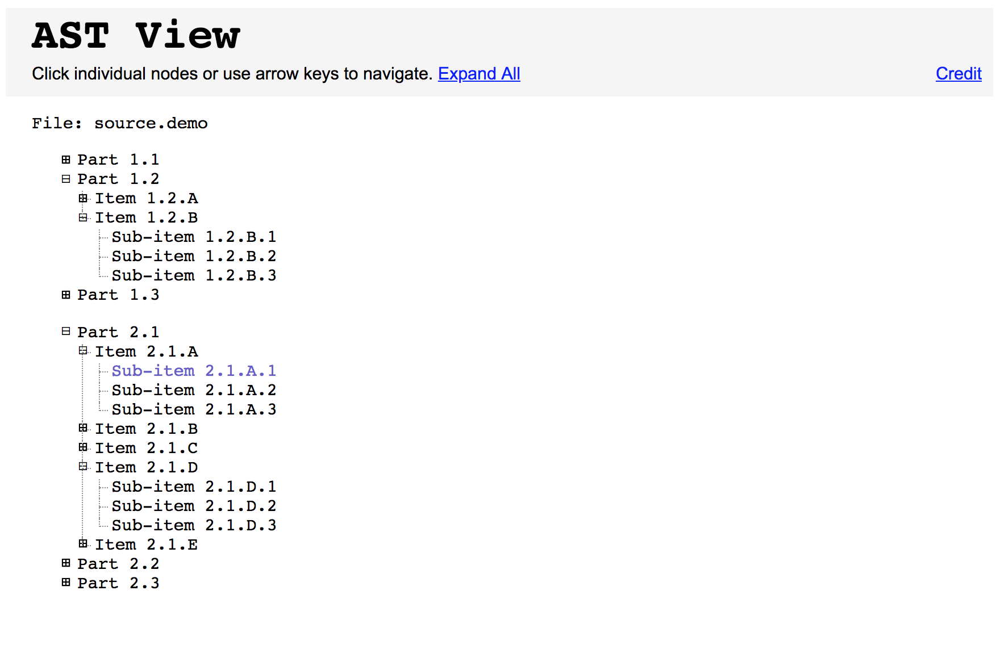

# expandable-tree-list

Standalone HTML format with CSS and native JavaScript embedded. Single-file, no libraries required.

Clickable, navigatable.

Take JSON as input: you need to populate the section "generated content" (in JSON format) manually or programmatically from another source.

### Features

1. You may navigate the tree using arrow keys.
2. Expand/collapse the entire tree with one button (or Enter/Space key).
3. Expand/collapse a single node with a click or Left/Right arrow keys.
4. Current node highlighted.

###### EOF
